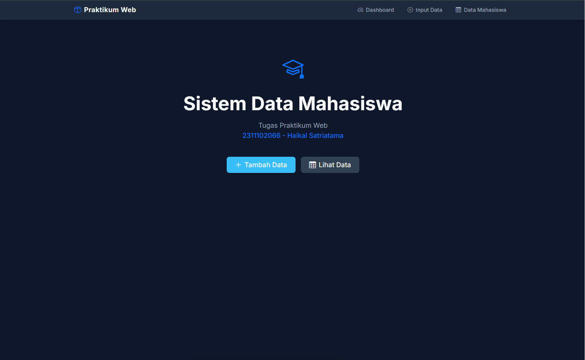
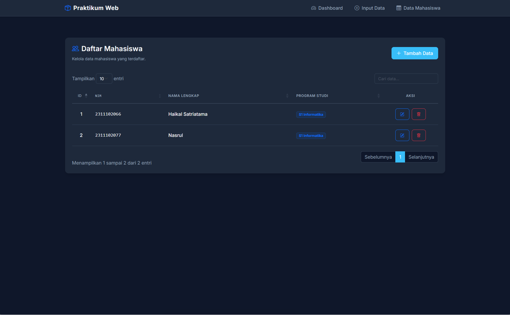
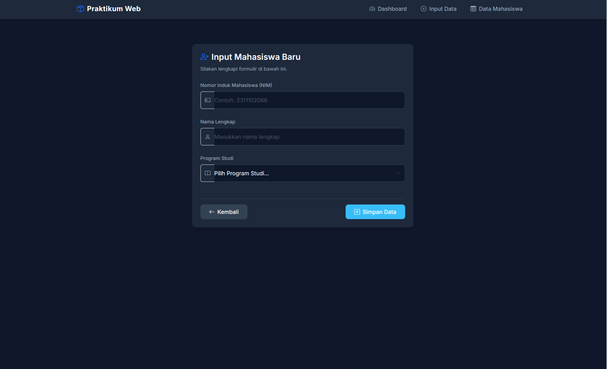
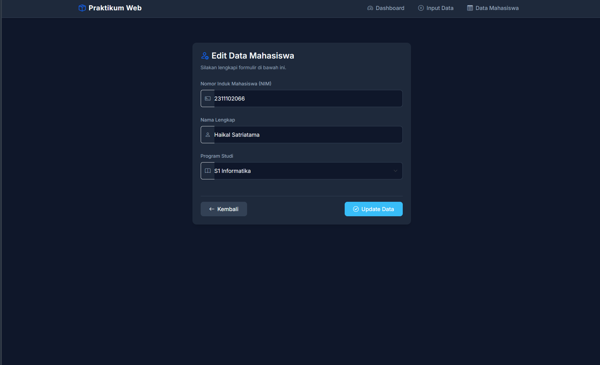

<div align="center">
  <br />

  <h1>LAPORAN PRAKTIKUM <br>
  APLIKASI BERBASIS PLATFORM
  </h1>

  <br />

  <h3>TUGAS COTS-1<br>
  </h3>

  <br />

  

  <br />
  <br />
  <br />

  <h3>Disusun Oleh :</h3>

  <p>
    <strong>Haikal Satriatama</strong><br>
    <strong>2311102066</strong><br>
    <strong>S1 IF-11-04</strong>
  </p>

  <br />

  <h3>Dosen Pengampu :</h3>

  <p>
    <strong>Cahyo Prihantoro, S.Kom., M.Eng.</strong>
  </p>
  
  <br />
  <br />
    <h4>Asisten Praktikum :</h4>
    <strong>Gilang Saputra</strong> <br>
    <strong>Rangga Pradarrell Fathi</strong>
  <br />

  <h3>LABORATORIUM HIGH PERFORMANCE
 <br>FAKULTAS INFORMATIKA <br>UNIVERSITAS TELKOM PURWOKERTO <br>2026</h3>
</div>

<hr>

## 📖 Deskripsi Aplikasi

Sistem Pendataan Mahasiswa adalah aplikasi web sederhana yang dirancang untuk mengelola data mahasiswa melalui antarmuka berbasis _web_ yang profesional dan responsif. Aplikasi ini dibangun menggunakan Node.js dengan framework Express.js dan _view engine_ EJS, serta menerapkan konsep _Create, Read, Update, Delete_ (CRUD) dengan format penyimpanan menggunakan file JSON. Pada sisi antarmuka, aplikasi menggunakan Bootstrap 5 dan Datatables berbasis jQuery dengan tema gelap khusus (_custom dark theme_) agar memiliki UI/UX yang modern dan ramah pengguna.

---

## 1. Dasar Teori

- **Node.js**: _Runtime environment_ JavaScript yang beroperasi pada lingkungan server (backend) yang dibangun dengan _engine_ V8.
- **Express.js**: Kerangka kerja aplikasi web Node.js yang minimal dan fleksibel, menyediakan serangkaian fitur kuat untuk membangun aplikasi web dan _Application Programming Interface_ (API).
- **EJS (Embedded JavaScript Templating)**: Mesin _template_ sederhana untuk Node.js yang digunakan untuk menyisipkan variabel JavaScript ke dalam kerangka HTML.
- **Bootstrap 5**: Kerangka kerja CSS _open-source_ terpopuler untuk mengembangkan _website responsive_ dan _mobile-first_.
- **jQuery & DataTables**: _Library_ JavaScript yang memungkinkan pengolahan data tabel HTML menjadi lebih interaktif (pencarian, paginasi, dan pengurutan) tanpa perlu _reload_ halaman penuh secara sinkron.
- **JSON (JavaScript Object Notation)**: Format pertukaran data ringan yang mudah dibaca oleh manusia dan mudah diurai oleh mesin.

---

## 2. Fitur Aplikasi

1. **Halaman Dashboard**: Halaman utama aplikasi yang menyediakan informasi umum sistem pendataan mahasiswa dan tombol _Call To Action_ menuju fitur-fitur yang ada.
2. **Halaman Input Data Mahasiswa (Create)**: Formulir _input_ untuk menambahkan data mahasiswa baru.
3. **Halaman Tabel Data Mahasiswa (Read)**: Menampilkan seluruh data mahasiswa dengan fitur pencarian dan paginasi data menggunakan DataTables yang telah disesuaikan antarmukanya.
4. **Halaman Edit Data (Update)**: Formulir yang dimanfaatkan untuk mengubah data mahasiswa yang telah terdaftar.
5. **Hapus Data (Delete)**: Mekanisme penghapusan data dengan modal dialog untuk melakukan konfirmasi tindakan guna menghindari penghapusan data tidak disengaja.

---

## 3. Cara Menjalankan Aplikasi

```bash
npm install
node index.js
```

Akses pada Web Browser:

```
http://localhost:3000
```

---

## 4. Struktur Folder dan Kode Program

Berikut adalah struktur hirarki folder dan file yang menyusun aplikasi ini beserta penjelasan tiap fungsinya:

```text
.
├── data/
│   └── mahasiswa.json       # File database penyimpanan berupa array of object JSON (ID, NIM, Nama, Prodi).
├── public/
│   └── css/
│       └── style.css        # File custom CSS untuk override Bootstrap & DataTables (Tema Dark Blue/Slate).
├── views/
│   ├── layout.ejs           # Kerangka utama UI (Navbar, Link CSS, Link JS jQuery/Bootstrap).
│   ├── index.ejs            # Halaman Dashboard selamat datang & tombol rute utama.
│   ├── form.ejs             # Halaman Form Input & Update data mahasiswa (menggunakan AJAX).
│   └── data.ejs             # Halaman Tabel yang merender jQuery DataTables & aksi hapus data via modal.
├── .gitignore               # Konfigurasi file/folder yang diabaikan Git (node_modules, data/mahasiswa.json).
├── index.js                 # File server Node.js. Berisi setup Express, Routing EJS, dan Rest API CRUD (GET, POST, PUT, DELETE).
├── package.json             # Berisi metadata project dan daftar dependencies npm.
└── README.md                # File dokumentasi aplikasi (laporan tugas).
```

### Penjelasan File Kode

1. **`index.js`**
   Merupakan _entry point_ server. Menggunakan module `express`, `fs` (File System untuk baca/tulis `mahasiswa.json`), dan `cors`. Memiliki dua tipe _routes_:
   - _View Routes_ (`/`, `/form`, `/data`) untuk melayani halaman EJS.
   - _API Routes_ (`/api/mahasiswa`) untuk menangani _request_ CRUD berbasis JSON dari antarmuka pengguna.
2. **`views/layout.ejs`**
   Menggunakan fitur _partial_ milik EJS untuk membungkus halaman lain. Memuat `<nav>` navigasi secara global dan menyematkan _library_ eksternal melalui _CDN_ (Bootstrap, Bootstrap Icons, jQuery).
3. **`views/form.ejs`**
   Memiliki struktur HTML `<form>` yang akan menangkap URL parameter `?id=`. Jika ada ID, AJAX melakukan GET untuk otomatis mengisi input (Mode Update). Saat form di-submit, jQuery AJAX menangkap nilai input dan menembak _method_ `POST` (Data Baru) atau `PUT` (Update) ke server Node.js.
4. **`views/data.ejs`**
   Memuat tabel _front-end_. Logika utamanya ada pada skrip inisialisasi `$('#tabelMahasiswa').DataTable()`, di mana DataTables diatur untuk memuat data (AJAX `GET`) dari `dataSrc: 'data'` milik server. Dilengkapi fungsi JS untuk memunculkan modal hapus dan mengirimkan `DELETE` _request_ via AJAX.

---

## 5. Screenshot Website

### 1. Halaman Utama
Halaman _Dashboard_ selamat datang yang mencakup informasi pemilik tugas dan tombol navigasi langsung.


### 2. Halaman Tambah
Formulir input mahasiswa dengan kolom NIM, Nama Lengkap, dan pilihan Program Studi _dropdown_.


### 3. Halaman Edit Data & Data Tabel
Tampilan tabel yang telah dipasang pustaka _DataTables_ untuk pencarian data secara _realtime_ dan terdapat tombol aksi (Edit & Hapus) di setiap baris. Ketika tombol _Edit_ ditekan, pengguna akan diarahkan ke form dengan data yang telah terisi.


### 4. Konfirmasi Halaman Hapus Data
Tampilan _modal pop-up_ persetujuan saat _user_ mencoba untuk menghapus salah satu data.


---

## 6. Kesimpulan

Aplikasi Pendataan Mahasiswa ini berhasil memenuhi persyaratan pengerjaan tugas terkait pembuatan 3 halaman web, penerapan CRUD yang fungsional menggunakan JavaScript (Node.js/Express.js), penyimpanan JSON (_File System_), serta penggunaan jQuery dan Datatables. Aplikasi ini tidak hanya fungsional secara fitur, tetapi juga memperhatikan aspek kemudahan dan kenyamanan pengguna dengan memanfaatkan sistem Grid dan Komponen dari Bootstrap 5 yang dimodifikasi khusus melalui CSS _custom_ untuk mendapatkan tema gelap biru _slate_ dan _sky_. Penggunaan Express dan EJS memungkinkan integrasi yang cepat antara pemrosesan data (backend) dengan representasi tampilan (frontend).

---

## 7. Referensi

- https://nodejs.org
- https://expressjs.com
- https://getbootstrap.com
- https://datatables.net
- https://icons.getbootstrap.com/

---
